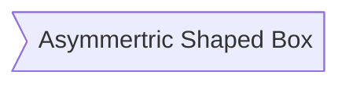

## Text Format
[Basic formatting syntax - Obsidian Help](https://help.obsidian.md/Editing+and+formatting/Basic+formatting+syntax) 

| Types                     | How it's typed                                                                                                                                                | How it's rendered                                                                                                                                             | Comment                                                                                                                                                                                                                                                                                                                                                                                                                                                           |
| ------------------------- | ------------------------------------------------------------------------------------------------------------------------------------------------------------- | ------------------------------------------------------------------------------------------------------------------------------------------------------------- | ----------------------------------------------------------------------------------------------------------------------------------------------------------------------------------------------------------------------------------------------------------------------------------------------------------------------------------------------------------------------------------------------------------------------------------------------------------------- |
| Plain Text                | text                                                                                                                                                          | text                                                                                                                                                          |                                                                                                                                                                                                                                                                                                                                                                                                                                                                   |
| Bold                      | 1. `**text**`<br>2. `__text__`<br>3. `<strong>text</strong>`                                                                                                  | 1. **text**<br>2. __text__<br>3. <strong>text</strong>                                                                                                        | 1 & 2. any text between `** **` or `__ __` will be bolded<br>3. [[#HTML syntax]]                                                                                                                                                                                                                                                                                                                                                                                  |
| Italic                    | 1. `*text*`<br>2. `_text_`<br>3. `<em>text</em>`                                                                                                              | 1. *text*<br>2. _text_<br>3. <em>text</em>                                                                                                                    | 1 & 2. any text between `* *` or `_ _` will be italicized<br>3. [[#HTML syntax]]                                                                                                                                                                                                                                                                                                                                                                                  |
| Highlight                 | 1. `＝＝text＝＝`<br>2. `<mark style="background: #6bbd67;">text</mark>`                                                                                          | 1. ==text==<br>2. <mark style="background: #6bbd67;">text</mark>                                                                                              | 1. any text between `＝＝ ＝＝` will be highlighted<br>2. [[#HTML syntax]] highlight can be modified with Hex color `#6bbd67` inside `"background: ;"`                                                                                                                                                                                                                                                                                                                |
| Underline                 | 1. `<u>text</u>`<br>2. `<a>text</a>`<br>3. `<a style="color: orange">text</a>`                                                                                | 1. <u>text</u><br>2. <a>text</a><br>3. <a style="color: orange">text</a>                                                                                      | 1. [[#HTML syntax]] any text between `<u> </u>` will be underlined<br>2. [[#HTML syntax]] Link text gets underlined when hovered, but will not open any link. Not recommended because it's easily mistaken with [[#Internal links]]<br>3. [[#HTML syntax]] Link text gets underlined when hovered. And the text color can by modified with Hex color `orange` inside `"color: "`. It's a useful alternative to underline or highlight for color coding techniques |
| Colored Text              | 1. `<font style="color:red">Text</font>`<br>2. `<font style="color:yellow; background: black">Text</font>`                                                    | 1. <font style="color:red">Text</font><br>2. <font style="color:yellow; background: black">Text</font>                                                        | [[#HTML syntax]] Colored text is a useful alternative to underline and highlight for color coding techniques<br>2. Combine both text color and highlight color                                                                                                                                                                                                                                                                                                    |
| Styled Text               | 1. `<span style="font-family:American Typewriter">text</span>`<br>2. `<span style="font-family: American Typewriter; color:green; font-size:2em">Text</span>` | 1. <span style="font-family:American Typewriter">text</span><br>2. <span style="font-family: American Typewriter; color:green; font-size:2em">Text</span><br> | 1. [[#HTML syntax]] I can also change text style via `Setting > Appearance > Font: Manage`<br>	• In the setting, whichever text style on top will be rendered<br>	• Text style changed this way will affect all the texts in editor, except this styled text example will override the Font Setting<br>2. [[#HTML syntax]] combine colored text, styled text and size                                                                                             |
| Strikethrough             | 1. `~~text~~`<br>2. `<s>text</s>`<br>3. `<del>text</del>`                                                                                                     | 1. ~~text~~<br>2. <s>text</s><br>3. <del>text</del>                                                                                                           | 1. any text between `~~ ~~` will be strikethroughed<br>2 + 3. [[#HTML syntax]]                                                                                                                                                                                                                                                                                                                                                                                    |
| Title                     | 1. `$$this~~is~~Title$$`<br>2. `$$this is Title$$`<br>3. `<center>This is Title</center>`                                                                     | 1. $$this~~is~~Title$$<br>2. $$this is Title$$<br>3. <center>This is Title</center>                                                                           | 1 & 2. any text between `$$ $$` will be centered and italic<br>1. Use `~` to make space between words<br>3. [[#HTML syntax]]                                                                                                                                                                                                                                                                                                                                      |
| Comment                   | 1. `%%text%%`<br>2. `<!--text-->`                                                                                                                             | 1. %%text%%<br>2. <!--text-->                                                                                                                                 | 1. any text between `%% %%` will be hidden. Only visible in Editing mode<br>2. [[#HTML syntax]]                                                                                                                                                                                                                                                                                                                                                                   |
| Combined multiple formats | `＝＝***text***＝＝`                                                                                                                                              | ==***text***==                                                                                                                                                | this example combined bold, italic and highlight together                                                                                                                                                                                                                                                                                                                                                                                                         |
| Inline code               | 1. ``text``<br>2. `<code>text</code>`                                                                                                                         | 1. `text`<br>2. <code>text</code>                                                                                                                             | 1. any text between `` `` will not be rendered as it should be<br>2. [[#HTML syntax]]                                                                                                                                                                                                                                                                                                                                                                             |

>[!tip]+ Tip
> You can use [[Start Here#Hotkeys|Hotkeys]] (keyboard shortcuts) instead of remembering markdown syntax. 
> Here is some suggested hotkeys, but you can always edit any hotkeys in Setting.
> 
> | Command       | Suggested Hotkey                |
> | ------------- | ------------------------------- |
> | Bold          | ⌘ B                             |
> | Italic        | ⌘ I                             |
> | Highlight     | ⌘ shift H                       |
> | Strikethrough | ⌘ shift S                       |
> | Comment       | ⌘ shift C                       |
> | Underline     | ⌘ U (required community plugin [Underline](obsidian://show-plugin?id=obsidian-underline)) |
> 

## Lists
- List using `-`
	- Sub-list

* List using `*`
	* Sub-list

+ List using `+`
	+ Sub-list

\- List using `＼-` 
	\- This `＼` will cancel effect after it.

1. Numbered Lists starting `1. (space)`
	1. You can start at any number.
2. Number 2
	1. Sub-list
	2. Sub-list

- [ ] Task List using `- [ ] (space)`
	- [ ] You can activate Task List via [[Start Here#Hotkeys|Hotkeys]] `⌘ return` (once when on numbered/bulleted list or twice when on a empty line)

1. [ ] Numbered Task List
	1. [ ] Sub-list

>[!tip]+ Tip
> You can use any character inside the brackets to mark it as complete. Default completed task list is `x`
> ```
> - [x] A
> - [?] B
> - [-] C
> ```
> - [x] A
> - [?] B
> - [-] C

## Quotes
`> This is a quote` 

> This is a quote
## Horizontal Line
1. `---` or `***` or `___`
2. `- - -` or `* * *` or `_ _ _` (separated by space)
3. `<hr>` (horizontal rule)

---
***
___
<hr>

## Headings
- For each `#`, you descend from *Heading 1* all the way to *Heading 6*
- Make a space between `#` and `Heading title` or it will become a tag `#tag`
- When a heading is folded (by clicking on downward arrow 🔽 to the left of the heading), all subheadings and contents below it will be hidden
- [[Start Here#Hotkeys|Hotkey]] `⌃ return` = toggle heading

```
# Heading 1
## Heading 2
### Heading 3
#### Heading 4
##### Heading 5
###### Heading 6
####### Heading 7: There is no heading 7
```
# Heading 1
## Heading 2
### Heading 3
#### Heading 4
##### Heading 5
###### Heading 6
####### Heading 7: There is no heading 7 

## Links
>[!tip]+ Tip
>  - **Open a link in a new tab**: `⌘ Click` (In Live Preview / Reading Mode) or `⌘ shift Click` (Source mode) the link
>  - **Open a link in a new pane**: `⌘ ⌥ Click` the link
>  - **Open a link in a new window**: `⌘ ⌥ shift Click` the link
>  - Or simply right-click the link for more options
>  - Test this link [[Start Here]]

>[!note]+ 2 types of link
> 1. Wikilink `[[ ]]`
> 2. Markdown `[ ]( )`

### Internal links 
| Types                           | How it's typed                                                             | How it's Rendered                                                                   | Comment                                                                                                                                                                      |
| ------------------------------- | -------------------------------------------------------------------------- | ----------------------------------------------------------------------------------- | ---------------------------------------------------------------------------------------------------------------------------------------------------------------------------- |
| Link to Note                    | 1. `[[file.name]]`<br>2. `[name](file%20name)`<br>3. `[name](<file name>)` | 1. [[Start Here]]<br>2. [Start Here](Start%20Here)<br>3. [Start Here](<Start Here>) | 1. The most common wiki link method<br>2. Using `%20` as space<br>3. If the file name is long, you would want to use `<file.name>`                                           |
| Link to Note with Modified Name | `[[file.name\|Modified Name]]`                                             | [[Start Here\|st4rt h3r3]]                                                          | `\` is not needed. The reason it appeared here is to support this table structure                                                                                            |
| Link to Heading within the note | 1. `[[#heading]]`<br>2. `[[this.file.name#heading]]`                       | 1. [[#Text Format]]<br>2. [[Markdown Syntax#Text Format]]                           | 1. Short version<br>2. Long version. You can modified the name though. E.g. [[Markdown Syntax#Text Format\|Text Format]]<br>• Using `shift` to auto-complete the `file.name` |
| Link to Heading from any note   | 1. `[[##heading]]`<br>2. `[[any.file.name#heading]]`                       | [[Obsidian#💬 Comment]]                                                             | Both options render the same result                                                                                                                                          |
| Link to Block within the note   | 1. `[[#^block]]` or `[[^block]]`<br>2. `[[this.file.name#^block]]`         | 1. [[#^adf818]]<br>2. [[Markdown Syntax#^adf818]]                                   | 1. Short version<br>2. Long version. You can modified the name though. E.g. [[Markdown Syntax#^adf818\|Highlight ideas]]                                                     |
| Link to Block from any note     | 1. `[[^^block]]`<br>2. `[[any.file.name^block]]`                           | [[Obsidian#^d12546]]                                                                | Both options render the same result                                                                                                                                          |

### External links 
| Types                       | How it's typed           | How it's rendered                                                  | Comment                                                                                                                                                                                                                                                                                                |
| --------------------------- | ------------------------ | ------------------------------------------------------------------ | ------------------------------------------------------------------------------------------------------------------------------------------------------------------------------------------------------------------------------------------------------------------------------------------------------ |
| Internet URL (webpage link) | `[name](Internet URL)`   | [Obsidian](https://obsidian.md/)                                   |                                                                                                                                                                                                                                                                                                        |
| HTML URL                    | `<a href="URL">name</a>` | <a href="https://obsidian.md/">Obsidian</a>                        | [[#HTML syntax]]                                                                                                                                                                                                                                                                                       |
| Obsidian URL                | `[name](Obsidian URL)`   | [Core Plugins](obsidian://open?vault=Tutorial&file=Core%20Plugins) | • To get Obsidian URL, right-click on a file in File Explorer > `Copy Obsidian URL`<br>• Obsidian URL allows you to open note from different vault<br>• You can use URL scheme (besides Obsidian URL) to open any URL. e.g. `btt://` to activate a script in [Better Touch Tool](https://folivora.ai/) |

### Embedding
#### Embedded Links
|                  | How it's typed   | How it's rendered                                          |
| ---------------- | ---------------- | ---------------------------------------------------------- |
| Embedded File    | `![[file.name]]` | ![[Obsidian]]                                              |
| Embedded Webpage | ``   |  |

#### Embedded Images
- Alignment & Resize only work for images, not videos and webpage
- With [[Snippets#Video Resize|Video Resize]] snippet, you can change resize the locally embedded video dimension

|                     | Internal image (from vault)                                                                                                                                                                                            | External image (from internet)                                                                                                                                                                                                                                     | HTML style                                                                                                                                                                                                                                                                          |
| ------------------- | ---------------------------------------------------------------------------------------------------------------------------------------------------------------------------------------------------------------------- | ------------------------------------------------------------------------------------------------------------------------------------------------------------------------------------------------------------------------------------------------------------------ | ----------------------------------------------------------------------------------------------------------------------------------------------------------------------------------------------------------------------------------------------------------------------------------- |
| Format              | `![[file.name]]`                                                                                                                                                                                                       | ``                                                                                                                                                                                                                                                     | ``                                                                                                                                                                                                                                                                   |
| Alignment           | `![[file.name\|left/right/center]]` (required snippet [[Snippets#Image Position\|Image Position]])                                                                                                                     | ``                                                                                                                                                                                                                                  | ``                                                                                                                                                                                                                                           |
| Resize              | `![[file.name\|100]]`                                                                                                                                                                                                  | ``                                                                                                                                                                                                                                                | ``                                                                                                                                                                                                                                            |
| Allignment +	Resize | `![[file.name\|right\|100]]`                                                                                                                                                                                           | ``                                                                                                                                                                                                                                         | ``                                                                                                                                                                                                                    |
| Example             | ![[Obsidian-icon.png\|right\|100]]                                                                                                                                                                                     |  |  |
| Comment             | • `\` is not needed. It's here to support the table structure<br>✅ loaded much faster<br>❌ cost local storage<br>✅ images will always be rendered as long as they are in the vault and their `file.name` stay the same | • `\` is not needed. It's here to support the table structure<br>❌ loaded slower, depend on internet connection<br>✅ does not cost local storage<br>❌ broken links or website crashes or image sources deleted → the image cannot be rendered                      | [[#HTML syntax]]                                                                                                                                                                                                                                                                    |

#### Embedded Videos
|                        | How it's typed   | How it's rendered                                |
| ---------------------- | ---------------- | ------------------------------------------------ |
| Embedded Local Video   | `![[file.name]]` | ![[example-video-1.mp4]]                         |
| Embedded Youtube Video | ``   |  |
##### iframe
[More iframe-1](https://www.w3schools.com/tags/tag_iframe.asp) [More iframe-2](https://developer.mozilla.org/en-US/docs/Web/HTML/Element/iframe)
- iframe is [[#HTML syntax]]
- iframe requires memory and cpu power

|                  | How it's typed                                                                                                                                                                                                                                                                                                                                                                                                                                                                                                                                                                                                                                                                                                                                                     | How it's rendered                                                                                                                                                                                                                                                                                                                                                                                                                                                                                                                                                                                                                                                                                                                                              | Comment                                                                                                                                                                                                                                                                                                                                      |
| ---------------- | ------------------------------------------------------------------------------------------------------------------------------------------------------------------------------------------------------------------------------------------------------------------------------------------------------------------------------------------------------------------------------------------------------------------------------------------------------------------------------------------------------------------------------------------------------------------------------------------------------------------------------------------------------------------------------------------------------------------------------------------------------------------ | -------------------------------------------------------------------------------------------------------------------------------------------------------------------------------------------------------------------------------------------------------------------------------------------------------------------------------------------------------------------------------------------------------------------------------------------------------------------------------------------------------------------------------------------------------------------------------------------------------------------------------------------------------------------------------------------------------------------------------------------------------------- | -------------------------------------------------------------------------------------------------------------------------------------------------------------------------------------------------------------------------------------------------------------------------------------------------------------------------------------------- |
| Embedded webpage | `<iframe width="420" height="420" src="https://obsidian.md/canvas" allowfullscreen></iframe>`                                                                                                                                                                                                                                                                                                                                                                                                                                                                                                                                                                                                                                                                      | <iframe width="420" height="420" src="https://obsidian.md/canvas" allowfullscreen></iframe>                                                                                                                                                                                                                                                                                                                                                                                                                                                                                                                                                                                                                                                                    | You can change the embedded size by adjusting width & height with your desired numbers                                                                                                                                                                                                                                                       |
| Embedded video   | 1. `<iframe width="420" height="350" src="https://www.youtube.com/embed/NnTvZWp5Q7o" title="Making a Minecraft Obsidian Block in Real Life Using Astro Tech Resin" frameborder="0" allow="accelerometer; autoplay; clipboard-write; encrypted-media; gyroscope; picture-in-picture; web-share" referrerpolicy="strict-origin-when-cross-origin" allowfullscreen></iframe>`<br>2. `<iframe width="420" height="350" src="https://www.youtube.com/embed/NnTvZWp5Q7o?start=178" title="Making a Minecraft Obsidian Block in Real Life Using Astro Tech Resin" frameborder="0" allow="accelerometer; autoplay; clipboard-write; encrypted-media; gyroscope; picture-in-picture; web-share" referrerpolicy="strict-origin-when-cross-origin" allowfullscreen></iframe>` | 1. <iframe width="420" height="350" src="https://www.youtube.com/embed/NnTvZWp5Q7o" title="Making a Minecraft Obsidian Block in Real Life Using Astro Tech Resin" frameborder="0" allow="accelerometer; autoplay; clipboard-write; encrypted-media; gyroscope; picture-in-picture; web-share" referrerpolicy="strict-origin-when-cross-origin" allowfullscreen></iframe><br>2. <iframe width="420" height="350" src="https://www.youtube.com/embed/NnTvZWp5Q7o?start=178" title="Making a Minecraft Obsidian Block in Real Life Using Astro Tech Resin" frameborder="0" allow="accelerometer; autoplay; clipboard-write; encrypted-media; gyroscope; picture-in-picture; web-share" referrerpolicy="strict-origin-when-cross-origin" allowfullscreen></iframe> | • To get the Youtube iframe code, right-click on Youtube video and `Copy embed code`<br>• Embedded Youtube videos don't have ads!<br>2. To start video at specific time, add `?start='seconds'` after URL like this `src="URL?start='seconds'"`<br>'seconds' are the total seconds at that time. In the example, I use `178` means at `2:58` |

### Query
- Query allows you to embed search results inside a note
- Query is written in [[#Code block]]
- [More about Search & Query](https://help.obsidian.md/Plugins/Search)

>[!note]+ Basic search
> **Query input**: `Tutorial`
> ```query
> Tutorial
> ```

>[!note]+ Path: search file path 
**Query input**: `path: Templates`
> ```query
> path: Templates
> ```

>[!note]+ File: search file name
> **Query input**: `file: Obsidian`
> ```query
> file: Obsidian
> ```

>[!note]+ Tag: search for tags
> **Query input**: `tag: #👤`
> ```query
> tag: #👤
> ```

>[!note]+ Line: search keywords on same line
> **Query input**: `line:(👤)`
> ```query
> line:(👤)
> ```

>[!note]+ Section: Search keywords under same heading
> **Query input**: `section:(I love it!)`
> ```query
> section:(I love it!)
> ```

>[!note]+ Using `-`: to exclude certain results in the search
> **Query input**: `path: Templates -"App"`
> ```query
> path: Templates -"App"
> ```

>[!note]+ Using OR: to combine multiple search criteria
> **Query input**: `path: Templates OR file: Tutorial`
> ```query
> path: Templates OR file: Tutorial
> ```

## Table
`/insert table`

| 1            | 2   |
| ------------ | --- |
| • A1<br>• A2 | B   |

>[!note]+ Note
> - Create a column or a row by clicking on `+` when hover to the right side or bottom of the table respectively
> - Rearrange a column or a row by holding & dragging on 6 dots icon when hover above or left side of the table respectively
> - Delete a column or a row by selecting the column or the row (clicking on 6 dots icon) and hit `delete` key
> - You can also right-click the table to perform these tasks above and more

>[!tip]+ Tip
> - `shift return` to enter a new line within a table cell
> - At the moment, you cannot link to a specific cell within a table. However, you can put a heading above the table and link to it, if you want to link to the table. Make sure the heading level is lower than the heading below it, or else when you collapse the heading, it will hide all the content below it. Plus when you embed the heading in canvas `Narrow to heading...`, only the content inside the heading is shown rather than all other irrelevant contents.

![[#HTML Table]]

## Callout
- Callout is a great way to summarize or highlight ideas ^adf818
- Use [[Start Here#Hotkeys|Hotkeys]] `⌘ ⌥ C` to insert Callout 
- For more information, visit [Callouts - Obsidian Help](https://help.obsidian.md/Editing+and+formatting/Callouts#Foldable%20callouts)

**How it's typed**
```
>[!note] Title
> Content of the Callout.
```

### All Callout default types
- There many types of Callout. You just simply change "note" (from the example above) to different keywords, such as tldr, todo, info, tip/hint/important, check/success/done, question/help/faq, warning/caution/attention, missing/fail/failure, error/danger, bug, example, quote/cite.
- You can even customize more callout styles by using community plugin [[Admonition]]

>[!note] note
> Content of the Callout.

>[!summary] tldr
> Aliases: summary, abstract 

>[!todo] todo
> - [ ] task

>[!info]+ info
>  - 

>[!tip] tip
>Aliases: hint, important

>[!check] check
> Aliases: success, done

>[!question]  question
> Aliases: help, faq

>[!warning] warning
> Aliases: caution, attention

>[!missing] missing
> Aliases: fail, failure

>[!error] error
> Aliases: danger

>[!bug] bug
> bug report

>[!example] example
>E.g. 

>[!quote] quote
> Aliases: cite

### Nested Callout
>[!note] Nesting Call out
> >[!quote] Nested Call out
> > Content of nested call out

### Toggle mode
>[!tip]+ Expanded Callout
>- Use `+` after `[!...]` to always show the Callout content
>- With this mode, it's opened by default until you click on toggle `v` to hide the content

>[!tip]- Collapsed Callout
>- Use `-` after `[!...]` to hide the Callout content
>- With this mode, it's closed by default until you click on toggle `>` to expand the content
>- Any Callout without `+` or `-` cannot be toggled
>- This is wonderful for *Spaced Repetition* method instead of using heading toggle. Plus, it's more simplified version of [[Admonition]]

>[!note]- Space Repetition example: 1 + 1 = ?
> 2

### Dropdown Menu Callout (snippet from FiekeB)
> [!menu|green_gradient] 
> - Column 1
>     - from [Dropdown showcase](https://forum.obsidian.md/t/want-a-multi-level-dropdown-menu-inside-your-notes-you-can-i-built-one/40501)
>     - Subfield 2
>     - Subfield 3
>     - Subfield 4
> - Column 2
>     - Subfield 1
>         - Sub Sub Field 1
>         - Sub Sub Field 2
> - Column 3
> 	- 1
> 	- 2
> 	- 3

## Tags
| Types                   | How it's typed                  | How it's rendered         | Comment                                                                                                        |
| ----------------------- | ------------------------------- | ------------------------- | -------------------------------------------------------------------------------------------------------------- |
| Common tag              | `#tag`                          | #tag                      |                                                                                                                |
| Tag with multiple words | `#tag_1`<br>`#tag-2`<br>`#tag3` | #tag_1<br>#tag-2<br>#tag3 | Use `-` or `_` to connect words together, leaving no space between for tag to work                             |
| Nested Tag              | `#tag/level1/level2`            | #tag/level1/level2        | You can create nested tag down as many levels as you like                                                      |
| Iconed Tag              | `#😃`                           | #😃                       | Using icon is a great substitution for long nested tag<br>e.g. `#👤/🔌/name` instead of `#Person/Plug-in/name` |

## Code
### Inline code
Anything between backticks `` `` will not be rendered like it should be in the Markdown Syntax. e.g. `text`
### Code block
Anything sandwiched between triple backticks ```` ```` will become code block.

>[!note]+ How it's typed
>  ```
>  code block
>  ```
 
>[!note]+ How it's rendered
> ```
> code block
> ```

**Code block is also used in community plugin**, such as [[Dataview]]

>[!note]+ How it's typed
```dataview
list from "Templates"
```

>[!note]+ How it's rendered
> ```dataview
> list from "Templates"
> ```

>[!tip]+ Tip
>  Try clicking on `</>` icon at the top right corner in the example below to edit the block quote

e.g.
```dataview
list from "Templates"
```

## Footnotes
Using `[^1]` at a word or a sentence you want to attach the footnote to and place `[^1]: information/explanation` usually at the end of the note (but you can place it anywhere and it will eventually appear at the end of the note in Reading mode)

This is an example [^1]
This is another example using the same numbered footnote [^1]

>[!tip]+ Tip
> - In Reading mode, you can hover over `[1]` (the example above) to see pop-up preview window
> - You can create as many footnotes as you like, with each footnote designated with a unique number

## Search
[Obsidian Help](https://help.obsidian.md/Plugins/Search)

| Searched keywords      | Description                                                                                                                                              |
| ---------------------- | -------------------------------------------------------------------------------------------------------------------------------------------------------- |
| `"This is a test"`     | It will search files that contain <u>exact phrase</u> `This is a test`. That means `"This test"` will not show up the same results as `"This is a test"` |
| `This is a test`       | It will search files that contains 4 different words `This`, `is`, `a`, and `test` within the files                                                      |
| `"She said, \"Hi\""`   | It will search files that contains this phrase `She said, "Hi"`                                                                                          |
| `A OR B`               | It will search files that contains either `A` or `B`. It will show a lot of search results                                                               |
| `A (B OR C) D`         | It will search files that contains `A`, `D` and either `B` or `C`                                                                                        |
| `A -B -C` = `A -(B C)` | It will search files that contains `A` but not `B` & `C`                                                                                                 |

| Search operator | Example                           | Description                                                                                                                                                                                                                                                                   |
| --------------- | --------------------------------- | ----------------------------------------------------------------------------------------------------------------------------------------------------------------------------------------------------------------------------------------------------------------------------- |
| `file:`         | `file:.jpg` or `file:2024-04-24`. | Find text in filename. Matches any file in the vault.                                                                                                                                                                                                                         |
| `path:`         | `path:"Daily notes/2022-07"`      | Find text in file path. Matches any file in the vault.                                                                                                                                                                                                                        |
| `content:`      | `content:"happy family"`          | Find text in file content.                                                                                                                                                                                                                                                    |
| `match-case:`   | `match-case:HappyFamily`          | Case-sensitive match.                                                                                                                                                                                                                                                         |
| `ignore-case:`  | `ignore-case:"This is a test"`    | Case-insensitive match. I find this one the most useful because I can easily search keywords without remembering if it's capital or not. OR you can toggle `Aa` (Match case).                                                                                                 |
| `tag:`          | `tag:#work`                       | Find tag in file.<br>• Keep in mind that searching for `tag:#work` will not return results for `#myjob/work`.  <br>• Since `tag:` ignores matches in code blocks and in non-Markdown content, it's often faster and more accurate than a normal full-text search for `#work`. |
| `line:`         | `line:(mix flour)`                | Find matches on the same line.                                                                                                                                                                                                                                                |
| `block:`        | `block:(dog cat)`                 | Find matches in the same block. It works similar as `line:`, but takes longer to finish because it requires Search to parse the Markdown content in every file                                                                                                                |
| `section:`      | `section:(dog cat)`               | Find matches in the same section (text between two headings).                                                                                                                                                                                                                 |
| `task:`         | `task:Sub-list`                   | Find matches in a [[#List\|Task List]] on a block-by-block basis.                                                                                                                                                                                                             |
| `task-todo:`    | `task-todo:Sub-list`              | Find matches in an _uncompleted_ [[#List\|Task List]] on a block-by-block basis.                                                                                                                                                                                              |
| `task-done:`    | `task-done:Using`                 | Find matches in a _completed_ [[#List\|Task List]] on a block-by-block basis.                                                                                                                                                                                                 |

## More advanced syntax
### Properties
[More about Properties](https://help.obsidian.md/Editing+and+formatting/Properties) 

| Live Preview                                                | Source mode                                                                                                                                                  |
| ----------------------------------------------------------- | ------------------------------------------------------------------------------------------------------------------------------------------------------------ |
| ![[Obsidian-properties.jpg\|600]]<br>[[Properties example]] | ---<br>Text: Plain Text<br>List:<br>  - A<br>  - B<br>  - C<br>Number: 1234<br>Checkbox: true<br>Date: 2024-06-22<br>Date & Time: 2024-06-22T23:30:00<br>--- |

| Types       | Inputs              | Comment                                                                                                                                                                                                                                                                |
| ----------- | ------------------- | ---------------------------------------------------------------------------------------------------------------------------------------------------------------------------------------------------------------------------------------------------------------------- |
| Text        | Plain Text          | Text field will remember the inputs = when you type, it will suggest previous inputs                                                                                                                                                                                   |
| List        | - A<br>- B          | • Click icon `X` to remove an item from the list                                                                                                                                                                                                                       |
| Number      | 123456789           | Letters cannot be entered                                                                                                                                                                                                                                              |
| Checkbox    | true / false        | true = ticked<br>false = unticked                                                                                                                                                                                                                                      |
| Date        | YYYY-MM-DD          | • Click on calendar icon 🗓️ to modify the date or click directly to specific time components to edit<br>If `DD` is missing, it will be defaulted as `01`<br>If `MM` is missing, it will be defaulted as `01`                                                          |
| Date & Time | YYYY-MM-DDTHH:mm:ss | • Click on calendar icon 🗓️ to modify the date or click directly to specific time components to edit<br>If `ss` is missing, it will be defaulted as `00`<br>If `mm` is missing, it will be defaulted as `00`<br>if `HH` is missng, it will be defaulted as `12:00 AM` |

| 2 ways to create Inputs                      | Position               | How it's typed            |
| -------------------------------------------- | ---------------------- | ------------------------- |
| Frontmatter (YAML) - supported by Properties | At the top of the file | ---<br>type: input<br>--- |
| Backmatter                                   | Anywhere outside YAML  | type:: input              |

### HTML syntax
[Basic Syntax | Markdown Guide](https://www.markdownguide.org/basic-syntax/)

#### HTML Paragraph
Anything inside `<p> ... </p>` will be in a paragraph and anything outside it will be in a different paragraph.

>[!note]+ How it's typed
> `*This sentence* <p>This is the first paragraph</p> <p>This is the second paragraph</p> *is in the same line*`

>[!note]+ How it's rendered
> *This sentence* <p>This is the first paragraph</p> <p>This is the second paragraph</p> *is in the same line*

#### HTML Line break
`<br>` = `return`

>[!note]+ How it's typed
> `This is the first line.<br>This is the second line.`

>[!note]+ How it's rendered
> This is the first line.<br>This is the second line.

#### HTML Table
**How it's typed**
```
<table>
<thead>
    <tr>
      <th>A</th>
      <th>B</th>
    </tr>
  </thead>
  <tbody>
    <tr>
      <td>1</td>
      <td>2</td>
    </tr>
  </tbody>
</table>
```

**How it's rendered**
<table>
  <thead>
    <tr>
      <th>A</th>
      <th>B</th>
    </tr>
  </thead>
  <tbody>
    <tr>
      <td>1</td>
      <td>2</td>
    </tr>
  </tbody>
</table>

#### Other HTML Syntax 
Other HTML Syntax can be found in [[#Text Format]] table

|                | Markdown                                                                                                                                              | HTML                                                                                                                                                                             | HTML rendered                                                                                                                                                        |
| -------------- | ----------------------------------------------------------------------------------------------------------------------------------------------------- | -------------------------------------------------------------------------------------------------------------------------------------------------------------------------------- | -------------------------------------------------------------------------------------------------------------------------------------------------------------------- |
| Heading        | `# Heading level 1`<br>`## Heading level 2`<br>`### Heading level 3`<br>`#### Heading level 4`<br>`##### Heading level 5`<br>`###### Heading level 6` | `<h1>Heading level 1</h1>`<br>`<h2>Heading level 2</h2>`<br>`<h3>Heading level 3</h3>`<br>`<h4>Heading level 4</h4>`<br>`<h5>Heading level 5</h5>`<br>`<h6>Heading level 6</h6>` | <h1>Heading level 1</h1><br><h2>Heading level 2</h2><br><h3>Heading level 3</h3><br><h4>Heading level 4</h4><br><h5>Heading level 5</h5><br><h6>Heading level 6</h6> |
| List           | `- Item 1`<br>`- Item 2`                                                                                                                              | `<li>Item 1</li><li>Item 2</li>`                                                                                                                                                 | <li>Item 1</li><li>Item 2</li>                                                                                                                                       |
| Ordered List   | `1. Item 1`<br>`2. Item 2`                                                                                                                            | `<ol><li>Item 1</li><li>Item 2</li></ol>`                                                                                                                                        | <ol><li>Item 1</li><li>Item 2</li></ol>                                                                                                                              |
| Unordered	List | `- Item 1`<br>`- Item 2`                                                                                                                              | `<ul><li>Item 1</li><li>Item 2</li></ul>`                                                                                                                                        | <ul><li>Item 1</li><li>Item 2</li></ul>                                                                                                                              |
| URL Link       | `[name](URL)`                                                                                                                                         | `<a href="URL">name</a>`                                                                                                                                                         | <a href="https://obsidian.md/">Obsidian Homepage</a>                                                                                                                 |

### Math-Latex
[MathJax basic tutorial and quick reference](https://math.meta.stackexchange.com/questions/5020/mathjax-basic-tutorial-and-quick-reference) This website will give you more math syntax if you want to go deeper.

**Basics**
- Using `$...$` to formulate into math. e.g. $a+b=c$
- Using `$$...$$` to align the math-latex in the center. e.g. $$a+b=c$$

| Categories       | Types                    | How it's typed                             | How it's rendered                                                                                                   |
| ---------------- | ------------------------ | ------------------------------------------ | ------------------------------------------------------------------------------------------------------------------- |
| Common notations | Multiply                 | `$\times$`                                 | $\times$                                                                                                            |
|                  | Divide                   | `$\div$`                                   | $\div$                                                                                                              |
|                  | Plus-minus               | `$\pm$`                                    | $\pm$                                                                                                               |
|                  | Minus-plus               | `$\mp$`                                    | $\mp$                                                                                                               |
|                  | Lower than               | `$\lt$`                                    | $\lt$                                                                                                               |
|                  | Greater than             | `$\gt$`                                    | $\gt$                                                                                                               |
|                  | Lower than or equal to   | `$\le$`                                    | $\le$                                                                                                               |
|                  | Greater than or equal to | `$\ge$`                                    | $\ge$                                                                                                               |
|                  | Not equal                | `$\neq$`                                   | $\neq$                                                                                                              |
|                  | Percentage               | `$\%$`                                     | $\%$                                                                                                                |
| Other            | Fraction                 | 1. `$\frac{a}{b}$`<br>2. `${\frac ab}$`    | 1. $\frac{a}{b}$<br>2. ${\frac ab}$                                                                                 |
|                  | Square Root              | 1. `$\sqrt{x}$`<br>2. `$\sqrt[3]{y}$`      | 1. $\sqrt{x}$<br>2. $\sqrt[3]{y}$                                                                                   |
|                  | Superscript              | `$x^2 + y^2 = z^2$`                        | $x^2 + y^2 = z^2$                                                                                                   |
|                  | Subscript                | 1. `$\log_2 x$`<br>2. `$x_b^a$`            | 1. $\log_2 x$<br>2. $x_b^a$                                                                                         |
| Spaces           | Simple space             | 1. `$a~b$`<br>2. `$a~~b$`                  | 1. $a~b$<br>2. $a~~b$                                                                                               |
|                  | Wide space               | `$a\quad b$`                               | $a\quad b$                                                                                                          |
|                  | Wider space              | `$a\qquad b$`                              | $a\qquad b$                                                                                                         |
| Arrow            | Right arrow              | 1. `$\to$`<br>2. `$\rightarrow$`           | 1. $\to$<br>2. $\rightarrow$                                                                                        |
|                  | Left arrow               | 1. `$\gets$`<br>2. `$\leftarrow$`          | 1. $\gets$<br>2. $\leftarrow$                                                                                       |
|                  | Double-right arrow       | `$\Rightarrow$`                            | $\Rightarrow$                                                                                                       |
|                  | Double-left arrow        | `$\Leftarrow$`                             | $\Leftarrow$                                                                                                        |
|                  | Maps to                  | 1. `$\mapsto$`<br>2. `$\longmapsto$`       | 1. $\mapsto$<br>2. $\longmapsto$                                                                                    |
|                  | Imply                    | `$\implies$`                               | $\implies$                                                                                                          |
|                  | If and only if           | `$\iff$`                                   | $\iff$                                                                                                              |
| Parentheses      | Parentheses              | 1. `$(x)$`<br>2. `$(\frac{\sqrt x}{y^3})$` | 1. $(x)$<br>2. $(\frac{\sqrt x}{y^3})$                                                                              |
|                  | Brackets                 | `$[x]$`                                    | $[x]$                                                                                                               |
|                  | Curly Braces             | `$\{x\}$`                                  | $\{x\}$                                                                                                             |
|                  | Vertical                 | 1. `$\|x\|$`<br>2. `$\vert x \vert$`       | 1. $\|x\|$ (It's supposed to be a single vertical line. It's modified by the table structure)<br>2. $\vert x \vert$ |
|                  | Angle                    | `$\langle x \rangle$`                      | $\langle x \rangle$                                                                                                 |
| Greek Letters    | Alpha                    | `$\alpha$`                                 | $\alpha$                                                                                                            |
|                  | Beta                     | `$\beta$`                                  | $\beta$                                                                                                             |
|                  | Gamma                    | 1. `$\Gamma$`<br>2. `$\gamma$`             | 1. $\Gamma$<br>2. $\gamma$                                                                                          |
|                  | Delta                    | 1. `$\Delta$`<br>2. `$\delta$`             | 1. $\Delta$<br>2. $\delta$                                                                                          |
|                  | Omega                    | 1. `$\Omega$`<br>2. `$\omega$`             | 1. $\Omega$<br>2. $\omega$                                                                                          |
|                  | Pi                       | 1. `$\Pi$`<br>2. `$\pi$`                   | 1. $\Pi$<br>2. $\pi$                                                                                                |
|                  | Alphabets                | `$A, B, C$`                                | $A, B, C$                                                                                                           |
|                  | Epsilon                  | `$\epsilon$`                               | $\epsilon$                                                                                                          |
|                  | Varepsilon               | `$\varepsilon$`                            | $\varepsilon$                                                                                                       |
|                  | Phi                      | `$\phi$`                                   | $\phi$                                                                                                              |
|                  | Varphi                   | `$\varphi$`                                | $\varphi$                                                                                                           |
**More advanced examples**

| How it's typed                                         | How it's rendered                                  |
| ------------------------------------------------------ | -------------------------------------------------- |
| `$$ \begin{vmatrix}a & b\\ c & d \end{vmatrix}=ad-bc$` | $\begin{vmatrix}a & b\\ c & d \end{vmatrix}=ad-bc$ |
| `$e^{2i\pi} = 1$`                                      | $e^{2i\pi} = 1$                                    |
| `$\lim_{x \to a} \frac{f(x)-f(a)}{x-a}$`               | $\lim_{x \to a} \frac{f(x)-f(a)}{x-a}$             |
| `$\vec{R} = \vec{F_1} + \vec{F_2}$`                    | $\vec{R} = \vec{F_1} + \vec{F_2}$                  |
| `$\sum_{i=0}^n i^2 = \frac{(n^2+n)(2n+1)}{6}$`         | $\sum_{i=0}^n i^2 = \frac{(n^2+n)(2n+1)}{6}$       |

### Mermaid
[Introduction to Mermaid graphs in Markdown](https://towardsdatascience.com/introduction-to-mermaid-graphs-in-markdown-080d4377cab4) [About Mermaid](https://mermaid.js.org/intro/)
Mermaid is JavaScript-based diagrams and chart tools
>[!note]+ How it's typed
> ｀｀｀mermaid
> Chart ID
> ｀｀｀

#### Graph
`graph` & `flowchart` are interchangeable
##### Directions
- **Default direction**

1. **Top to Bottom** `graph TB`

2. **Bottom to Top** `graph BT`

3. **Left to Right** `graph LR`

4. **Right to Left** `graph RL`


##### Subgraphs


>[!note]+ Comment
> - `subgraph "name/ID"` e.g. `subgraph subgraph1` means the subgraph with the name/ID "subgraph1" which can point to or be pointed at by any ID 
> - `end` to notify the end of the subgraph
> - You can create *sub-sub-graph*

##### Alias


>[!note]+ Comment
> - `A[alias]` write an alternate name inside `[ ]`
> - For connection, use ID `A` not "alias" (e.g. `A-->C`) because using `alias` will create another ID that is different from ID `A` with the name "alias". **Plus** an ID must be a letter or a string of words with no space in between. (e.g. `Item-A` or `Item_A` not `Item A`)

##### Label
- `A-->|label| B`
- `<br>` (break) enter a new line


##### Shapes
>[!note]+ Note
> - Texts inside the brackets will appear inside the shape
> - `shape` in examples below is an ID just like in [[#Alias]] `A[alias]`

- **Normal Box** `shape[ ]`

- **Pill Shaped Box** `shape([ ])`

- **Rounded-Edge Box** `shape( )`

- **Subroutine Shaped Box** `shape[[ ]]`

- **Cylindrical Shaped Box** `shape[( )]-->boxb[( )]`

- **Circle Shaped Box** `shape(( ))`

- **Double Circle** `shape((( )))`

- **Asymmetric Shaped Box** `shape> ]`

- **Rhombus Shaped Box** `shape{ }`

- **Hexagon Shaped Box** `shape{{ }}`

- **Parallelogram** `shape[/ /]`
```mermaid
graph
shape[/Parallelogram/]
```
- **Parallelogram Alternative** `shape[\ \]`
```mermaid
graph
shape[\Parallelogram\]
```
- **Trapezoid** `shape[/ \]`
```mermaid
graph
shape[/Trapezoid Shaped Box\]
```
- **Trapezoid Alternative** `shape[\ /]`
```mermaid
graph
shape[\Trapezoid Shaped Box/]
```
- **Colored** 
```mermaid  
graph LR
ItemA-->ItemB-->ItemC
style ItemA fill:#C4F7A1, stroke:#ff9300, stroke-width:2px
style ItemB fill:#FFEC51, stroke:#ff9300, stroke-width:4px, stroke-dasharray:5 1
style ItemC fill:#FFC4EB, stroke:#ff9300, stroke-width:6px
```

>[!note]+ Note
>- Using Hex Color Codes `#123456`
>- `fill` the shape color
>- `stroke` the border color
>- `stroke-width` using pixel (px)
>- `stroke-dasharray` dotted border (the higher value the more dot scattering)

##### Arrow styles
- **Arrow head** `A-->B`
```mermaid 
graph LR
A-->B
```
- **Circle edge** `A--oB`
```mermaid 
graph LR
A--oB
```
- **Cross edge** `A--xB`
```mermaid 
graph LR
A--xB
```
- **Open Link** `A---B`
```mermaid 
graph LR
A---B
```
- **Dotted Link** `A-.-B`
```mermaid 
graph LR
A-.-B
```
- **Invisible Link** `A~~~B`
```mermaid 
graph LR
A~~~B
```
- **Text on Link** `A--Text-->B`
```mermaid 
graph LR
A--Text-->B
```
- **Dotted Link with Text** `A-.Text.->B`
```mermaid 
graph LR
A-.Text.->B
```
- **Thick Link** `A＝＝>B`
```mermaid 
graph LR
A==>B
```
- **Bothways** `A1<-->B1` and `A2<==>B2`
```mermaid 
graph LR
A1<-->B1
```
```mermaid 
graph LR
A2<==>B2
```

##### Link lengths

| Length            | 1      | 2       | 3        |
| ----------------- | ------ | ------- | -------- |
| Normal            | `---`  | `----`  | `-----`  |
| Normal with arrow | `-->`  | `--->`  | `---->`  |
| Thick             | `＝＝＝`  | `＝＝＝＝`  | `＝＝＝＝＝`  |
| Thick with arrow  | `＝＝>`  | `＝＝＝>`  | `＝＝＝＝>`  |
| Dotted            | `-.-`  | `-..-`  | `-...-`  |
| Dotted with arrow | `-.->` | `-..->` | `-...->` |
`A1-->B1` | `A2--->B2` | `A3---->B3`
```mermaid 
graph LR
A1-->B1
```
```mermaid 
graph LR
A2--->B2
```
```mermaid 
graph LR
A3---->B3
```

##### Click 
- `click A "URL"` Click on `A` to open the link
```mermaid
graph LR
A---B
click A "https://mermaid.js.org/syntax/flowchart.html"
click B "https://obsidian.md/"
```

##### Comment
- `%% adding comment here will not affect the graph`
```mermaid
graph LR
A-->B
%% this is comment section where I can add notes without affecting the graph
```

##### Complex Graphs
```mermaid  
graph
A[ItemA]--> ItemB
A--> ItemC
subgraph ItemC
D[ItemD]-->E[ItemE]
E-->D
end
X[ItemX]==>Decision
click X "https://mermaid.js.org/"
Decision{Item Y?}==>|Yes| Y[ItemY]
Decision==>|No| Z[ItemZ]
```

>[!note]+ Comment
> - `A[ItemA]-->ItemB` means ID "A" with the display name "ItemA" is pointing to ID "ItemB"
> - `A-->ItemC` means ID "A" is pointing to ID "ItemC. However, ID "Item A" in `ItemA-->ItemC` will not refer to ID "A" and create a separate graph
> - `subgraph end` means the subgraph named "ItemC" containing "ItemE" and "ItemD"
> - `X[ItemX]==>Decision` means ID "X" with the display name "ItemX" is pointing to ID "Decision"
> - `click X "https://mermaid.js.org/"` means when click on "X" (ItemX), it will open the link `https://mermaid.js.org/`
> - `Decision{Item Y?}==>|Yes| Y[ItemY]` means ID "Decision" with the display name "Item Y?" in [[#Shapes]] `{ }` of diamond, labeled "Yes", is pointing to ID "Y" with the display name "ItemY"
> - `Decision==>|No| Z[ItemZ]` means ID "Decision" with the display name "Item Y?", labeled "No", is pointing to ID "Z" with the display name "ItemZ"

#### Pie Chart
```mermaid
pie 
title Users
"Mobile": 50
"Desktop": 40
"Tablet": 10
```

>[!note]+ Comment
> - **Chart ID:** `Pie`
> - `title Users` means Chart title named "Users"
> - `"Mobile": 50` means section "Mobile" takes up value of "50"
> - `"Desktop": 40` means section "Desktop" takes up value of "40"
> - `"Tablet": 10` means section "Tablet" takes up value of "10"
> - Mermaid will convert values to percentages

#### XY Chart
```mermaid
xychart-beta
title "XY chart"
x-axis "Purchase date" [Jan, Feb, Mar, Apr, May, Jun]
y-axis "Y variable" 0 --> 100
bar [50, 60, 75, 82, 75, 40]
line [50, 45, 75, 82, 65, 55]
```

>[!note]+ Comment
> - **Chart ID:** `xychart-beta`
> - `title "XY chart"` means Graph title named "XY chart"
> - `x-axis "Purchase date" [Jan, Feb, Mar, Apr, May, Jun]` means the horizontal x-axis title named "Purchase Date" with 6 values named "Jan, Feb, Mar, Apr, May, Jun"
> - `y-axis "Y variable" 0 --> 100` means the vertical y-axis title named "Y variable" with value from 0 to 100
> - `bar [50, 60, 75, 82, 75, 40]` means there are 6 bar values
> - `line [50, 45, 75, 82, 65, 55]` means there are 6 line values
> - Line chart doesn't work in this chart

#### Sankey Chart
```mermaid
sankey-beta
Category L1, Category R1, 5
Category L1, Category R2, 10
Category L2, Category R1, 15
Category L2, Category R3, 8
Category L3, Category R3, 20
```

>[!note]+ Comment
> - **Chart ID:** `sankey-beta`
> - This chart doesn't work properly

#### Quadrant Chart
```mermaid  
quadrantChart
title Quadrant chart
x-axis Left x --> Right x
y-axis Bottom y --> Top y
quadrant-1 Quadrant A
quadrant-2 Quadrant B
quadrant-3 Quadrant C
quadrant-4 Quadrant D
Point A: [0.3, 0.6]
Point B: [0.4, 0.2]
Point C: [0.6, 0.8]
Point D: [0.8, 0.3]
Point E: [0.2, 0.3]
Point F: [0.5, 0.7]
```

>[!note]+ Comment
> - **Chart ID:** `quadrantChart`
> - `title Quadrant chart` means Chart title named "Quadrant chart"
> - `x-axis Left x --> Right x` means horizontal x-axis has 2 values from left to right "Left x" and "Right x"
> - `y-axis Bottom y --> Top y` means vertical y-axis has 2 values from bottom up "Bottom y" and "Top y"
> - `quadrant-1 Quadrant A` means the first quadrant (top right) is named "Quadrant A"
> - `quadrant-2 Quadrant B` means the second quadrant (top left) is named "Quadrant B"
> - `quadrant-3 Quadrant C` means the third quadrant (bottom left) is named "Quadrant C"
> - `quadrant-4 Quadrant D` means the fourth quadrant (bottom right) is named "Quadrant D"
> - `Point A: [0.3, 0.6]` means Point A is at position with x=0.3 (lesser than 0.5) and y=0.6 (greater than 0.5) → Point A is from the left of the vertical centerline and from above the horizontal centerline
> - `Point B: [0.4, 0.2]` means Point B is at position with x=0.4 and y=0.2


#### Timeline
```mermaid  
timeline  
title Timeline
2015: Event A: Event B  
2020: Covid Pandemic emerged
2025: Event D: Event E: Event F
```

>[!note]+ Comment
> - **Chart ID:** `timeline`
> - `title Timeline` means Graph title named "Timeline"
> - `2015: EventA: EventB` means in year 2015, there were 2 events named "Event A" & "Event B"
> - `2020: Covid Pandemic emerged` means in year 2020, there was 1 event named "Covid Pandemic emerged"

#### Gantt Chart
```mermaid
gantt
title Gantt chart
dateFormat YYYY-MM-DD
axisFormat %b %d
section Section A
	Task A1: 2024-04-15, 7d
	Task A2: 5d
section Section B
	Task B1: 2024-04-22, 2024-05-02
	Task B2: 2024-04-29, 5d
```

>[!note]+ Comment
> - **Chart ID:** gantt
> - `title Gantt chart` means Chart Title named "Gannt chart"
> - `dateFormat YYYY-MM-DD` means this Gantt chart will use time code `YYYY-MM-DD` (Year-Month-Date). More about [Date Format-1](https://4js.com/online_documentation/fjs-fgl-3.00.05-manual-html/c_fgl_DataConversions_format_datetimes.html) & [Date Format-2](https://momentjscom.readthedocs.io/en/latest/moment/04-displaying/01-format/)
> - `axisFormat %b %d` will display `MMM-DD`
> - **There are 2 sections**: Section A and Section B. Each has 2 sub-sections named "Task A & B" .
> 	- `Task A1: 2024-04-15, 7d` means sub-section "Task A1" started on April 15, 2024 with duration of 7 day
> 	- `Task A2: 5d` means Task A2 is placed after Task A1 and started on April 22, 2024 with duration of 5 days
> 	- `Task B1: 2024-04-22, 2024-05-02` means Task B1 started on April 22, 2024 and ended on May 2, 2024
> 	- `Task B2: 2024-04-29, 5d` means Task B2 started on April 29, 2024 with the duration of 5 days


#### User Journey
```mermaid
journey
title Daily meals
section Breakfast
	Sugar: 7: Turtle
    Oatmeal: 5: Me
    Junk food: 0: Me, Turtle
section Dinner
    Birthday cake: 10: Me
    Lake: 9: Turtle
    Bathroom: 0: Me, Turtle
```

>[!note]+ Comment
> - **Chart ID:** `journey`
> - `title Daily meals` means Chart title named "Daily meals"
> - *There are 2 sections*: "Breakfast" and "Dinner". Each section has 3 items/activities, following this format `Item 1: Value: Person 1, Person 2`
> 	- `Sugar: 7: Turtle` means the item/activity named "Sugar", value of 7, and done by "Turtle"
> 	- Recommended value ranged from 0 to 7. Any value beyond this range will appear extreme. E.g. `Birthday cake: 10: Me` The emoji is hidden beneath the "Birthday cake"

#### Mind Map

```mermaid
mindmap
	root((Center node))
		Node1
			Node1A
			Node1B
			Node1C
		Node2
			Node2A
			Node2B
				Node2B1
				Node2B2
		Node3
			Node3A
			Node3B
		Node4
			Node4A
				Node4A1
```

>[!note]+ Comment
> - `root((Center node))` means the root node named "Center node". Another variation `root(Center node)` will appear smaller oval shape. There can only be 1 root. 
> - Hierarchy is essential to make this chart work. Children node will be indented from the parent node

#### State Diagram
```mermaid  
stateDiagram  
[*] --> StateA  
StateA --> [*]  
StateA --> StateB  
StateB --> StateA  
StateB --> StateD  
StateD --> [*]
A --> B
a --> b
B --> b
```

>[!note]+ Comment
> - **Diagram ID:** `stateDiagram`
> - Left `[*]` means the start state, whereas right `[*]` means the end state
> - Upper case and lower case are considered different items

#### Sequence Diagram
```mermaid
sequenceDiagram
Alice->>John: Hello John, wut's up ?!
John-->>Alice: Great!
Uncle Sam->>Alice: How are you, Alice?
Alice-->>Uncle Sam: Bleh!
Uncle Sam->>Uncle Sam: What's wrong with her?
Note right of Uncle Sam: Uhmm...
loop 
	Alice->>Uncle Sam: Stay away from me, old geezer!
end
```

>[!note]+ Comment
> - **Diagram ID:** `sequenceDiagram`
> - `->>` = solid arrow line | `-->>` = dotted arrow line
> - When a person appointed to themselves, such as `Uncle Sam->>Uncle Sam: What's wrong with her?`, it will become rounded arrow
> - `Note right of Uncle Sam: Uhmm...` means a separated note was placed to the right of "Uncle Sam" with the message "Uhmm..."
> - You can also make a loop `loop  end`

#### Class Diagram
```mermaid
classDiagram
Cloud storage o-- Obsidian_Vault
Obsidian_Vault <|-- Folder
Folder <-- Sub-Folder: inside
Sub-Folder -- Notes: inside
Folder *-- Notes: inside
Notes: Start Here
Notes: Markdown Syntax
Notes: Core Plugins, Community Plugins, (...)
```

>[!note]+ Comment
> - **Diagram ID:** `classDiagram`
> - *Arrow styles:* `-->`, `--|>`, `--*`, `--o`, `--`. Arrow direction can be reversed `<--`, `<|--`, `*--`, `o--`
> - `Folder <-- Sub-Folder: inside` means "Sub-Folder" class points its arrow to "Folder" class with label "inside"
> - `Notes: Start Here` means "Notes" class contains item "Start Here". You can enter new line by create another `Notes: Markdown Syntax`. To enter a new section, use `()` anywhere, e.g. `Notes: Core Plugins, Community Plugins, (...)`, except `Notes: (Core Plugins, Community Plugins, ...)`

#### Entity Relationship Diagram
```mermaid
erDiagram
Item1 ||--o{ Item2: text1
Item2 ||--|{ Item3: text2
Item1 }|..|{ Item4: text3
Item4 }o--o{ Item4: text3
```

>[!note]+ Comment
> - **Diagram ID:** `erDiagram`
> - *Arrow styles*
> 	1. `||--o{` in `Item1 ||--o{ Item2: text1`
> 	2. `||--|{` in `Item2 ||--|{ Item3: text2`
> 	3. `}|..|{` in `Item1 }|..|{ Item4: text3`
> 	4. `}o--o{` in `Item4 }o--o{ Item4: text3`


[^1]: Example of how footnote works